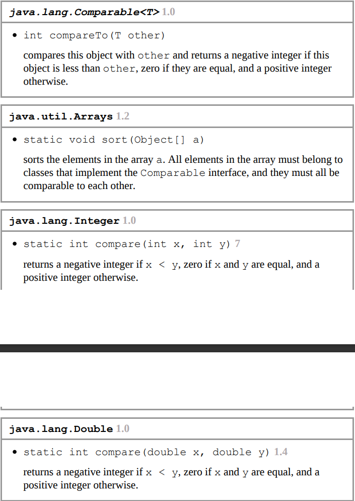
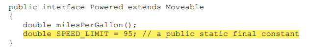
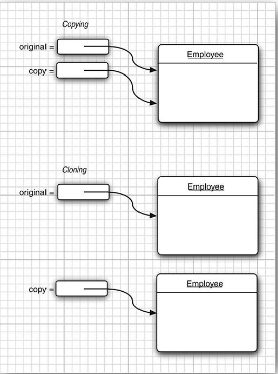
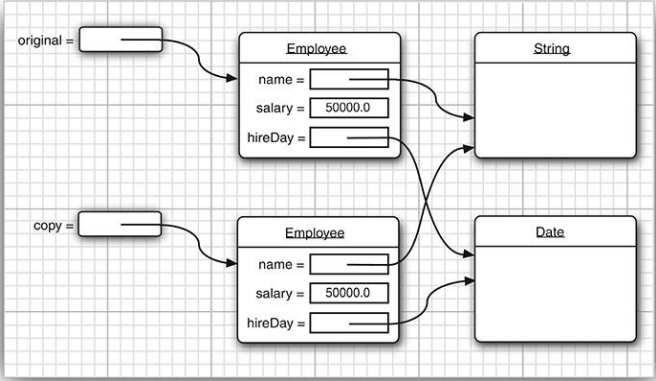

# Interfaces
- Interface is a way of describing what a class should do, without specifying how they should do it.
- A class can implement one or more interfaces.
- To make a class implement an interface, you carry out two steps:
		1. You declare that your class intends to implement the given interface using `implements` keyword.
		2. You supply definitions for all methods in the interface and declare them `public`.
- All methods in an interface are automatically public.
- However, when implementing the interface, you must declare the method as `public`. 
- Otherwise, the compiler assumes that the method has package access (default) for a class. The compiler then complains that you are trying to supply a more restrictive access privilege.



### Comparable Interface
-  For example, the `sort` method of `Arrays` class demands that the objects must implement the `Comparable` interface.
```Java
public interface Comparable<T>
{
	int compareTo(T other);
}
```
- The `compareTo` method returns negative number if the implicit parameter is smaller than the explicit parameter, zero if they are equal and a positive number otherwise.
```Java
class Employee implements Comparable<Employee>
{
	public int compareTo(Employee other)
	{
		return Double.compare(salary,other.salary); 
		// use Integer.compare(x,y) if x and y are integers
	}
}
```

### Properties of Interfaces
- You can never use the `new` operator to instantiate an interface
- However, you can still declare interface variables and it must refer to an object of a class that implements the interface.
- You can use `instanceof` to check whether an object implements an interface.
- Although you can't put instance fields in an interface, you can supply constants in them.
- 
- Methods in an interface are `public` and fields are `public static final` by default.
- Methods can also be `private`, but as these can only be used in the interface, they act as helper methods.
-  You can supply a `default` implementation for any interface method. you must tag such a method with the `default` modifier.
```Java
public interface Comparable<T>
{
	default int compareTo(T other){ return 0; }
}
```
- A `default` method can call other methods.
```Java
public interface Collection
{
	int size(); // an abstract method
	default boolean isEmpty() { return size() == 0; }
}
```
#### Resolving Default Method Conflicts
What happens if the exact same method is defined as a `default` method in one `interface` and then again as a method of a `superclass` or another `interface`?
1. `Superclasses` win. If a `superclass` provides a `concrete method`, `default` methods with the same name and parameter types are simply ignored.
2. `Interfaces` clash. If an `interface` provides a `default` method, and another interface contains a method with the same name and parameter types (**default or not**), then you must resolve the conflict by overriding that method.
##### Example
```Java
interface person
{
	default String getName() { return "";}
}
interface Named
{
	default String getName() { 
		return getClass().getName();
	}
}
```
What happens if you form a class that implements both of them?
- The Class inherits two inconsistent `getName` methods and instead of choosing one over the other, the Java compiler reports an error and leaves it up to the programmer to resolve the ambiguity.
```Java
Class Student implements Person,Named
{
	public String getName() { 
		return Person.super.getName();
	}
}
```
- Even if the `getName()` method in `Named` class was not declared `default`, the `Student` class wouldn't have inherited the `default` method of `Person` interface. 
- The compiler would have reported an error if an implementation had not been provided for that method.
### Interfaces vs Abstract Classes
- The major difference is that interfaces support multiple inheritance.
- Abstract classes can have instance fields and concrete methods where as interfaces can't.

### Interfaces and Callbacks (Unfinished)
- In callback pattern you specify an action that should occur whenever a particular event occurs.

### The Comparator Interface

- There is a second version of the `Arrays.sort` method whose parameters are an `array` and a `comparator`—an instance of a class that implements the `Comparator` interface.
```Java
public interface Comparator<T>
{
	int compare(T first,T second);
}
```
#### Example
Suppose you want to sort an array of strings by increasing length.

```Java
public class LengthComparator implements Comparator<String>
{
	public int compare(String a,String b)
	{
		return a.length() - b.length();
	}
}

// To sort an array
String[] friends = {"peter", "paul", "Mary"};
Arrays.sort(friends,new LengthComparator());
```
#### More about Comparators
- The Comparator interface has a number of convenient static methods for creating comparators.


### Object Cloning


```Java
var original = new Employee("John",50000);
Employee clonedEmp = original.clone(); //shallow copy
```
- The `clone` method is a protected method of `Object`, which means that your code cannot simply call it. 
- Only the Employee class can clone Employee objects.
- As you can see, the default cloning operation is “shallow”—it doesn’t clone objects that are referenced inside other objects.
- 
- The `clone` method is declared `protected` in the `Object` class, so that your code can’t simply call `anObject.clone()`.
- But aren’t `protected` methods accessible from any subclass, and isn’t every class a subclass of `Object`?
- A subclass can call a `protected` `clone` method only to clone its own objects.
- You must redefine `clone` to be `public` to allow objects to be cloned by any method.
- And you must implement the `Clonable` interface, but it doesn't specify the `clone` method, it merely serves as a tag, indicating that cloning is supposed to happen in this class.
```Java
//shallow copy
class Employee implements Clonable
{

	public Employee clone() throws CloneNotSUpportedException
	{
		return (Employee) super.clone() ; 
		// call clone method of Object class and cast it.
	}
}
```

#### Deep Cloning
```Java
class Employee implements Clonable
{

	public Employee clone() throws CloneNotSUpportedException
	{
		// call clone method of Object class and cast it.
		Employee cloned = (Employee) super.clone() ;
		//clone mutable reference fields
		cloned hireDay = (Date) hireDay.clone();
		//Here the Date class must implement the Clonable interface
		return cloned; 
	}
}
```
# Lambda Expressions
- A lambda expression is a block of code that you can pass around so it can be executed later, once or multiple times.
Example :
```Java
//single statement
(String first, String second) -> first.length() - second.length()

//multiple statements
(String first, String second) -> { 
	if (first.length() < second.length()) return -1; 
	else if (first.length() > second.length()) return 1; 
	else return 0; 
}

//no parameter
() -> { for (int i = 100; i >= 0; i--) System.out.println(i); }

```

- If the parameter types of a lambda expression can be inferred, you can omit them.
Example :
```Java
Comparator<String> comp = (first, second) -> first.length() - second.length();


Arrays.sort(strArr, (first, second) - > first.length() - second.length());
```

- If a method has a single parameter with inferred type, you can even omit the parentheses
```Java
event -> System.out.println(event)
```

- It is illegal for a lambda expression to return a value in some branches but not in others.
```Java
(int x) -> { if (x >=0) return 1; } //ERROR
```


### Functional Interfaces
- The interface which has only one abstract method is called a functional interface.
- You can supply a lambda expression whenever an object of a class that implements an interface with a single abstract method is expected.
- You may wonder aren’t all methods in an interface abstract?
	- Actually, it has always been possible for an interface to redeclare methods from the `Object` class such as `toString` or `clone`, and these declarations do not make the methods abstract.
	- Interfaces can also declare non abstract `default` methods as well.
- Conversion to a functional interface is the only thing that you can do with a lambda expression in Java.

#### Functional Interface Examples

The Java API defines a number of very generic functional interfaces in the `java.util.function` package.

- One of the interfaces, `BiFunction<T,U,R>`, describes functions with parameter types T and U and return type R.
```Java
BiFunction<String,String,Integer> comp = (first,second) -> first.length() - second.length();
```
- However there is no `Arrays.sort` method that wants a `BiFunction`.

- A particularly useful interface in the `java.util.function` package is `Predicate`:
```Java
public interface Predicate<T>
{
	boolean test(T t);
}
```
- The `ArrayList` class has a `removeIf` method that expects a predicate.
```Java
list.removeIf(e -> e == null);
```


- Another useful functional interface is `Supplier<T>`:
```Java
public interface Supplier<T>
{
	T get();
}
```
- A `Supplier` has no arguments and yields a value of type `T` when it is called.
- These are used for lazy evaluation.
```Java
LocalDate hireDay = Objects.requireNonNullOrElseGet(day, () -> new LocalDate(1970, 1, 1));

//only calls the supplier when the value is needed
```

### Method References
- It directs the compiler to produce an instance of a functional interface, overriding the single abstract method of the interface to call the given method.
- When a method reference is assigned to a functional interface variable, an object is created whose type is a functional interface.
```Java
var timer = new Timer(1000, System.out::println);
// System.out::println is a method reference
```
- Suppose you want to sort strings regardless of letter case.
```Java
Arrays.sort(strings,String::compareToIgnoreCase);
```
- the `::` operator separates the `method name` from the name of an `object` or `class`.
- There are 3 variants:
	1. `object::instanceMethod` : this method reference is equivalent to a lambda expression whose parameters are passed to the method.(For example `System.out.println(x)`)
	2. `Class::instanceMethod`: Here the first parameter becomes the implicit parameter of the method.(For example `x.compareToIgnoreCase(y)`)
	3. `Class::staticMethod`: Here all the parameters are passed to the static method.(For example `Math.pow(x,y)`)

- Note that a lambda expression can only be written as a method reference if the body of the lambda expression calls a single method and doesn't do anything else.
```Java
s -> s.length() == 0 
//Here a single method is called but a comparision is also done, so you can't use a method reference here.
```
#### Method Reference Examples

- You can also use the `this` and `super` in a method reference.
```Java
this::equals 
//is same as 
x -> this.equals(x)
```

### Constructor References
- These are just like method references but the method name is `new`.
```Java
ArrayList names = . . .; 
Stream stream = names.stream().map(Person::new); 
List people = stream.collect(Collectors.toList());
```
- Array constructor references are useful for creating array of generic types.
```Java
Object[] people = stream.toArray(); // Stream interface's toArray method returns an Object Array

Person[] pepople = stream.toArray(Person::new);
```

### Variable Scope
- A lambda expression has three ingredients :
	- A block of code
	- Parameters
	- Values of **free variables**, i.e the variables that are not parameters and not defined inside the code block, these are stored in the data structure representing the lambda expression.
- In Java, lambda expressions are **closures**.
- The technical term for a block of code together with the values of the free variables is a **closure**.
- In a lambda expression, you can only reference those free variables whose value doesn’t change.
```Java
public static void countDown(int start, int delay)
{
	ActionListener listener = event ->
	{
		start--; // ERROR: Can't mutate captured variable
		System.out.println(start);
	}
	new Timer(delay, listener).start();
}
```
- It is also illegal to refer, in a lambda expression, to a variable that is mutated outside.
```Java
public static void repeat(String text, int count)
{
	for (int i = 1; i <= count; i++)
	{
		ActionListener listener = event ->
		{
			System.out.println(i + ": " + text); 
			// ERROR: Cannot refer to changing i
		}
		new Timer(1000, listener).start();
	}
}
```
- The rule is that any captured variables in a lambda expression must be effectively `final`.
	- An effective `final` variable is a variable that is never assigned a new value after it has been initialized.
- In a method you can't have 2 local variables having same name, you can't introduce such variables in a lambda expression either.
```Java
Path first = Path.of("/usr/bin");
Comparator<String> comp = (first, second) -> first.length() - second.length();
//ERROR: variable first is already declared
```
- When you use the `this` keyword in a lambda expression, you refer to the `this` parameter of the method that creates the lambda.
```Java
public class Application
{
	public void init()
	{
		ActionListener listener = event ->
		{
			//here this refers to the Application object, 
			//not the ActionListener instance. 
			System.out.println(this.toString());
		}
	}
}
```

### Processing Lambda Expressions
- The point of using lambdas is ***deferred execution***.
- There are many reasons for executing code later, such as :
	- Running the code in a separate thread
	- Running the code multiple times
	- Running the code at the right point in an algorithm(for example, the comparison operation in sorting)
	- Running the code when something happens (a button was clicked, data has arrived, and so on)
	- Running the code only when necessary
- You need to use a Functional interface if you want your own method that accepts a lambda expression.

##### Common Functional Interfaces :


##### Example :

Suppose you want to repeat an action n times. The action and the count are passed to a repeat method :
```Java
public static void repeat(int n, Runnable action) 
{ 
	for (int i = 0; i < n; i++) action.run(); 
}
repeat(10, () -> System.out.println("Hello, World!"));
```

Suppose we want to tell the action in which iteration it occurs :
```Java

public static void repeat(int n, IntConsumer action) 
{ 
	for (int i = 0; i < n; i++) action.accept(i); 
}
repeat(10, i -> System.out.println("Countdown: " + (9 - i)));
```

##### Functional Interfaces for Primitive Types
![[Pasted_image_20230810141411.png]]